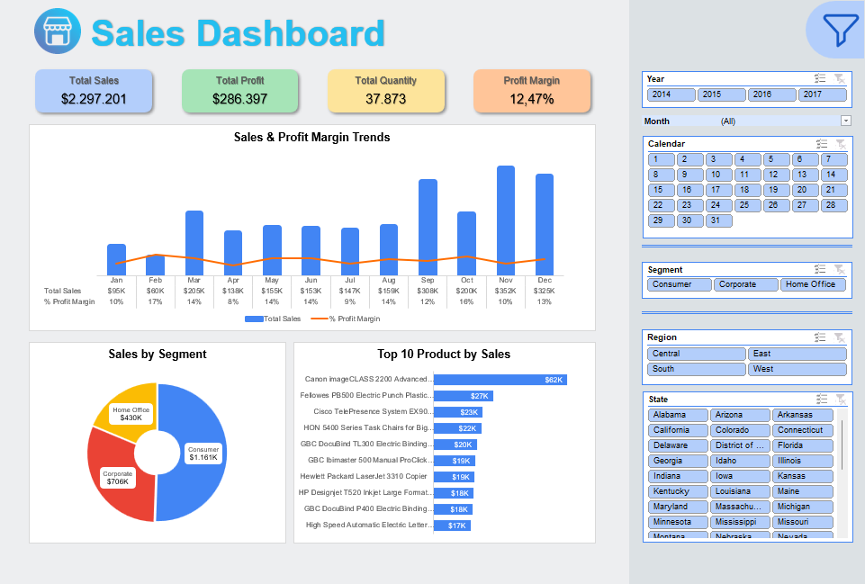

<h1 align='center'>
    Retail Sales Analytics Dashboard with Excel
</h1>

<!-- ABOUT THE PROJECT -->
## Project Overview

In this project we will analyze the sales performance and profit of a retail store. In the beginning we explore the data to find sales trends, customer composition, and the most sold products. Then we create a dashboard to gather all the insights using the right visualization.

Some of the questions that will be answered in this project are:
1. What is the total sales, profit, quantity and profit margin?
2. What is the best month for sales? How much was earned that month?
3. Which customer segment has a big impact on sales?
4. Which product has the highest sales?

<h3>
    Tools used
</h3> 

### About Dataset
For this project we analyze sales data at [Global Superstore](https://www.kaggle.com/datasets/vivek468/superstore-dataset-final). This dataset contains information about sales transactions, customers, products, and geographical locations in the period 2014-2017.

## Dashboard

    

 

<!-- Contact Info -->
## Contact

## Acknowledgements
* [MySkill](https://myskill.id/course/project-creating-sales-dashboard-in-excel)
* [Badges 4 README](https://github.com/alexandresanlim/Badges4-README.md-Profile/tree/master)

(<a href="#readme-top">back to top</a>)
